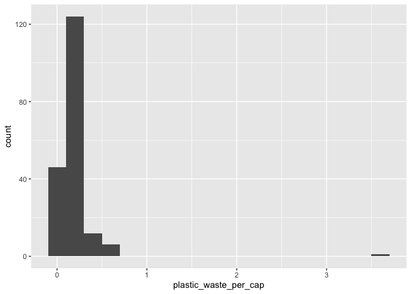
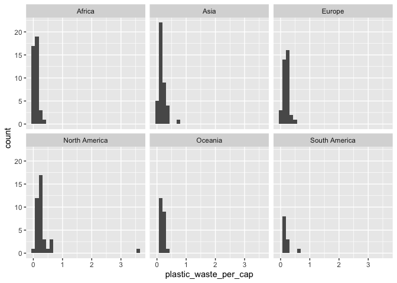
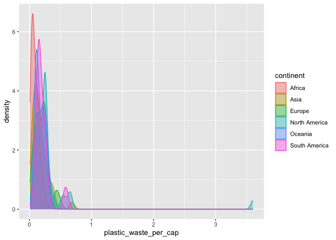

Lab 02 - Plastic waste
================
Rowan Kemmerly
1.24.23

## Load packages and data

``` r
library(tidyverse) 
```

``` r
plastic_waste <- read.csv("data/plastic-waste.csv")
```

## Exercises

### Exercise 1

First I’m looking at the distribution of plastic waste per capita in
2010.

``` r
ggplot(data = plastic_waste, aes(x = plastic_waste_per_cap)) +
  geom_histogram(binwidth = 0.2)
```

    ## Warning: Removed 51 rows containing non-finite values (`stat_bin()`).

<!-- -->

Trinidad and Tobago seems to have a much higher level of plastic waste
per capita than other countries:

``` r
plastic_waste %>%
  filter(plastic_waste_per_cap > 3.5)
```

    ##   code              entity     continent year gdp_per_cap plastic_waste_per_cap
    ## 1  TTO Trinidad and Tobago North America 2010    31260.91                   3.6
    ##   mismanaged_plastic_waste_per_cap mismanaged_plastic_waste coastal_pop
    ## 1                             0.19                    94066     1358433
    ##   total_pop
    ## 1   1341465

It seems like this could have been an error, though??
<https://tt.loopnews.com/content/swmcol-forbes-article-data-used-was-incorrect-and-dated>

In order to be able to examine the data without this outlier in the
future (if I want to) I will create a subset of the data without it:

``` r
plastic_waste_subset<- subset(plastic_waste, plastic_waste_per_cap < 3.5, 
                              select=code:total_pop)
```

------------------------------------------------------------------------

*Reminder of the basic structure of data visualization with ggplot:*

*ggplot(data = \[dataset\],* *mapping = aes(x = \[x-variable\],* *y =
\[y-variable\])) +* *geom_xxx() +* *other options*

------------------------------------------------------------------------

Now I am examining plastic waste per capita separated out by continent.

``` r
ggplot(data = plastic_waste, 
     mapping = aes(x = plastic_waste_per_cap)) +
   geom_histogram() +
   facet_wrap(~ continent)
```

    ## `stat_bin()` using `bins = 30`. Pick better value with `binwidth`.

    ## Warning: Removed 51 rows containing non-finite values (`stat_bin()`).

<!-- -->

Based on these graphs, it seems like people in South America and Oceania
generate less plastic waste than other continents. However, it’s hard to
tell based on these graphs how much plastic people produce relative to
the total population of each continent — these graphs mostly tell us
that a lot of people live in Africa and Asia but it’s hard to
distinguish each continent’s distribution with this bin size.

------------------------------------------------------------------------

Here’s the same data used for the very first graph, but instead of a
histogram in the form of a density plot.

``` r
ggplot(data = plastic_waste,
       aes(x = plastic_waste_per_cap)) +
  geom_density()
```

    ## Warning: Removed 51 rows containing non-finite values (`stat_density()`).

<!-- -->

Here’s a density plot with density curves for each continent.

``` r
ggplot(data = plastic_waste, 
       mapping = aes(x = plastic_waste_per_cap, 
                     color = continent)) +
  geom_density()
```

    ## Warning: Removed 51 rows containing non-finite values (`stat_density()`).

<!-- -->

Here’s that same plot with each of the curves filled in with the
corresponding color.

``` r
ggplot(data = plastic_waste, 
       mapping = aes(x = plastic_waste_per_cap, 
                     color = continent, 
                     fill = continent)) +
  geom_density()
```

    ## Warning: Removed 51 rows containing non-finite values (`stat_density()`).

<!-- -->

And here’s the same plot with more transparent density curve fills:

``` r
ggplot(data = plastic_waste, 
       mapping = aes(x = plastic_waste_per_cap, 
                     color = continent, 
                     fill = continent)) +
  geom_density(alpha = 0.7)
```

    ## Warning: Removed 51 rows containing non-finite values (`stat_density()`).

<!-- -->

### Exercise 2

#### 2.1

And finally, here’s a density plot that has color fills that are
transparent enough to actually see what all of the curves clustered to
the left side look like:

``` r
ggplot(data = plastic_waste, 
       mapping = aes(x = plastic_waste_per_cap, 
                     color = continent, 
                     fill = continent)) +
  geom_density(alpha = 0.4)
```

    ## Warning: Removed 51 rows containing non-finite values (`stat_density()`).

<!-- -->

#### 2.2

##### Describe why we defined the color and fill of the curves by mapping aesthetics of the plot but we defined the alpha level as a characteristic of the plotting geom.

Things that we want to apply to individual variables (but not all
variables) go with the “aesthetics” subfunction, while things that we
want to apply to the entire graph (i.e., to all of the plotted
variables) go outside of the ggplot function. The first type of
specification is called “mapping” while the second type of specification
is called “setting.”

### Exercise 3

Now, let’s try looking at the data in the form of box plots.

``` r
ggplot(data = plastic_waste, 
       mapping = aes(x = continent, 
                     y = plastic_waste_per_cap)) +
  geom_boxplot()
```

    ## Warning: Removed 51 rows containing non-finite values (`stat_boxplot()`).

<!-- -->

#### 3.1

As a comparison, here is the data graphed via violin plots.

``` r
ggplot(data = plastic_waste, 
       mapping = aes(x = continent, 
                     y = plastic_waste_per_cap)) +
  geom_violin()
```

    ## Warning: Removed 51 rows containing non-finite values (`stat_ydensity()`).

<!-- -->

Unlike the box plots, the violin plots show the shape of each
distribution (i.e., it’s easier to get a sense of how many cases
correspond with each quantity of plastic waste). However, unlike the
violin plots, the box plots clearly indicate where the interquartile
range and median are.

### Exercise 4

#### 4.1

Here is yet another way to look at the data: a scatterplot!

This scatterplot depicts the relationship between plastic waste per
capita and mismanaged plastic waste per capita.

``` r
ggplot(data = plastic_waste,
       aes(x = plastic_waste_per_cap,
       y = mismanaged_plastic_waste_per_cap)) +
  geom_point()
```

    ## Warning: Removed 51 rows containing missing values (`geom_point()`).

<!-- -->

It seems that there is a slight positive correlation between the two
variables.

#### 4.2

Adding in color differentiation by continent shows us that it seems like
there is a stronger correlation between plastic waste per capita and
mismanaged plastic waste per capita in North America, Asia, and Europe
than there is in Africa and Oceania.

``` r
ggplot(data = plastic_waste,
       aes(x = plastic_waste_per_cap,
       y = mismanaged_plastic_waste_per_cap,
       color = continent)) +
  geom_point()
```

    ## Warning: Removed 51 rows containing missing values (`geom_point()`).

<!-- -->

#### 4.3

Here I am examining the relationship between plastic waste per capita
and total population, as well as the relationship between plastic waste
per capita and coastal population. I decided to look at the data both
with and without the Trinidad and Tobago outlier because I was having a
hard time getting a good sense of the data with the outlier included (as
this clumps the data all in the bottom left corner).

``` r
ggplot(data = plastic_waste,
       aes(x = plastic_waste_per_cap,
       y = total_pop)) +
  geom_point()
```

    ## Warning: Removed 61 rows containing missing values (`geom_point()`).

<!-- -->

``` r
ggplot(data = plastic_waste_subset,
       aes(x = plastic_waste_per_cap,
       y = total_pop)) +
  geom_point()
```

    ## Warning: Removed 10 rows containing missing values (`geom_point()`).

<!-- -->

``` r
ggplot(data = plastic_waste,
       aes(x = plastic_waste_per_cap,
       y = coastal_pop)) +
  geom_point()
```

    ## Warning: Removed 51 rows containing missing values (`geom_point()`).

<!-- -->

``` r
ggplot(data = plastic_waste_subset,
       aes(x = plastic_waste_per_cap,
       y = coastal_pop)) +
  geom_point()
```

<!-- -->

It seems like there is a stronger linear association between plastic
waste per capita and coastal population.

### Exercise 5

Remove this text, and add your answer for Exercise 8 here.

``` r
# insert code here
```
